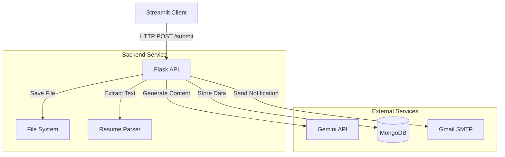
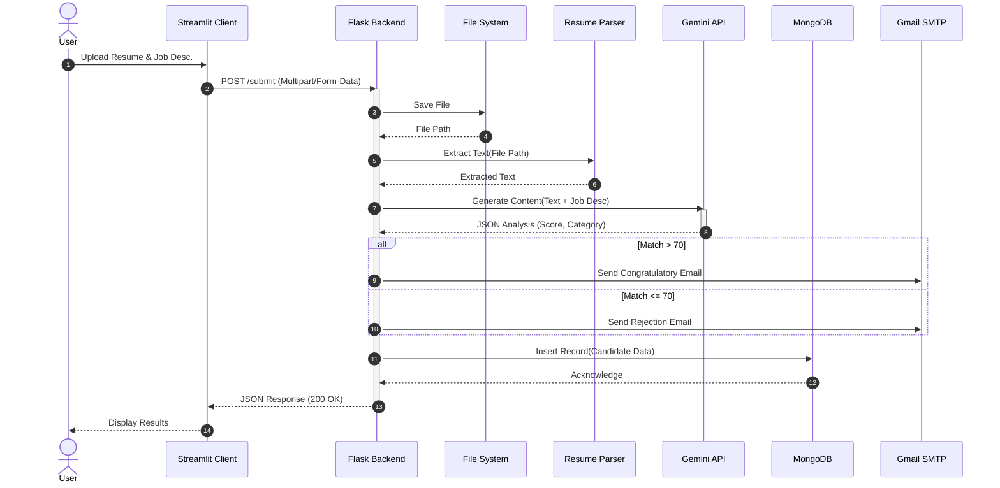

# Resume Screening Agent

A Python-based AI agent that screens resumes against job descriptions using Gemini and RAG, categorizes them, and automates email responses.

## Setup

1. Install dependencies:
   ```bash
   pip install -r backend/requirements.txt
   ```

2. Install Tesseract OCR:
   - Ubuntu: `sudo apt-get install tesseract-ocr`
   - Mac: `brew install tesseract`
   - Windows: Download from https://github.com/UB-Mannheim/tesseract/wiki

3. Set environment variables in `backend/.env`:
   ```
   GEMINI_API_KEY=your_gemini_api_key
   MONGO_URI=mongodb://localhost:27017/resume_db
   GMAIL_USER=your_email@gmail.com
   GMAIL_PASSWORD=your_app_password
   HR_EMAIL=hr@company.com
   ```

4. Run the backend:
   ```bash
   cd backend
   python app.py
   ```

5. Run the frontend:
   ```bash
   cd frontend
   streamlit run app.py
   ```

## Deployment

Using Docker:
```bash
docker build -t resume-screening-agent .
docker run -p 5000:5000 -p 8501:8501 resume-screening-agent
```

## Features

- Resume parsing (PDF, DOCX, images)
- RAG-based matching with Gemini API
- Automated email notifications
- MongoDB storage
- GDPR-compliant data handling

## Architecture

The system follows a client-server architecture with an AI-powered backend.



## Workflow

1. **User Submission**: The user uploads a resume and job description via the Streamlit frontend.
2. **Data Transmission**: The frontend sends a POST request to the Flask backend's `/submit` endpoint.
3. **Processing**:
   - The backend saves the uploaded file locally.
   - Text is extracted from the resume (PDF/DOCX/Image).
   - The text and job description are sent to the **Gemini API** for RAG-based analysis and scoring.
4. **Action**:
   - Based on the score (Match/Partial/Gap/Irrelevant), the system determines the category.
   - An automated email (Congratulation or Rejection) is sent to the candidate via **Gmail SMTP**.
5. **Persistence**: The application stores the candidate details, analysis, and score in **MongoDB**.
6. **Response**: The backend returns the results to the frontend, which displays the score and analysis to the user.

## System Interaction Flow

The following diagram illustrates the "packet flow" from the user's request to the system's response:

